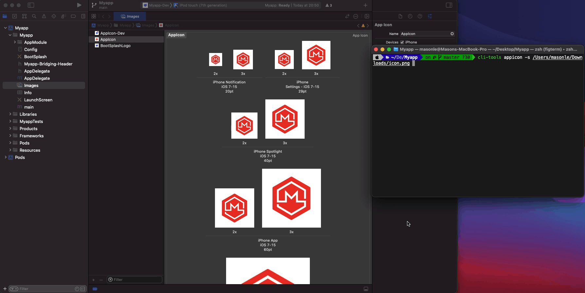

# Cli-tools

## Command

- [`appicon`](#appicon)

### `appicon`



Usage:

```sh
npx rn-ml appicon <flag>
```

#### `-s <path>` or `--source <path>` (Required)

Path to the image file

#### `-p [platform...]` or `--platform [platform...]`

> default: ['android','ios']

Either "ios" or "android" or "ipad" or "all"

#### `-f <string>` or `--flavor <string>`

> default: main

#### `-ar <string>` or `--android-source <string>`

> default: ./android

Custom android path

#### `-is <string>` or `--ios-source <string>`

> default: ./ios

#### `-icn <string>`

> default: AppIcon

Custom ios asset name

# License

MIT
